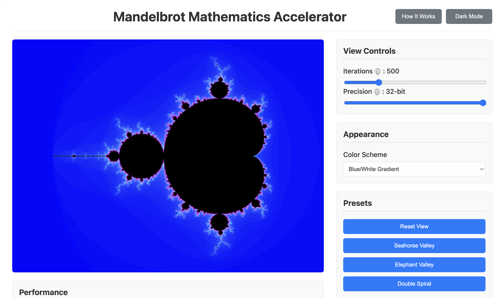
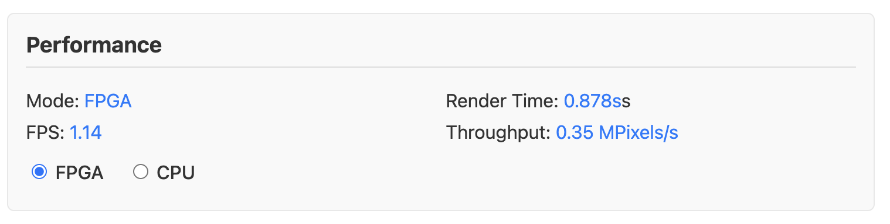
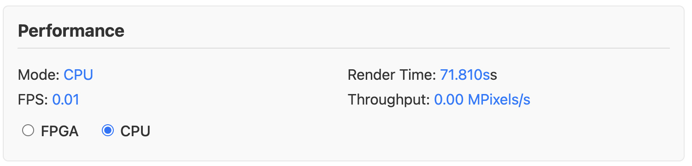

# Real-Time Mandelbrot Set Accelerator on PYNQ-Z1

<p align="left">
  <a href="https://www.xilinx.com/products/silicon-devices/soc/zynq-7000.html">
    
  </a>
  <a href="https://en.wikipedia.org/wiki/SystemVerilog">
    
  </a>
  <a href="https://www.python.org/">
    
  </a>
  <a href="https://flask.palletsprojects.com/">
    
  </a>
  <a href="https://www.xilinx.com/products/design-tools/vivado.html">
    
  </a>
</p>

This project demonstrates a complete hardware/software co-design of a real-time Mandelbrot Set fractal explorer, accelerated on a Xilinx Zynq-7000 SoC (PYNQ-Z1). The system leverages the parallelism of an FPGA to achieve high-speed rendering, controlled by a user-friendly web interface.

This repository serves as a portfolio piece showcasing skills in digital logic design, hardware acceleration, Python for hardware control, and full-stack web development.



## Performance: Hardware vs Software
The primary goal of this project was to demonstrate a significant performance increase by offloading the intensive Mandelbrot calculations to the FPGA. The system can switch between hardware (PL) and software (PS) rendering in real time to provide a direct comparison.

The FPGA implementation achieves an **~82x speed-up** over the pure Python/NumPy implementation running on the Zynq's ARM  A9 processor.

| Mode | FPGA (Programmable Logic) | CPU (Processing System) |
| -----| ---------------------------| ----------------------|
| Screenshot|  |  |
| Render Time| 0.878 seconds | 71.810 seconds |
| Frames Per Second | 1.14 FPS | 0.01 FPS |
| Throughput | 0.35 MPixels/s | ~0.00 MPixels/s |

## Core Features

*   **Real-Time Hardware Acceleration:** The computationally intensive Mandelbrot calculations are performed in parallel on the FPGA fabric, implemented in Verilog/SystemVerilog.
*   **Interactive Web-Based UI:** A modern, responsive user interface built with Flask, HTML, CSS, and JavaScript allows for intuitive control.
*   **Dynamic Exploration:** Users can pan, zoom, and adjust parameters in real time, receiving immediate visual feedback on an HDMI-connected display. This allows for deep exploration of the fractal's intricate details, such as the "Seahorse Valley" shown below:


*   **Live Performance Metrics:** The UI displays real-time statistics like Frames Per Second (FPS) and accelerator throughput (MPixels/s), directly comparing FPGA vs. CPU performance.
*   **Educational Interface:** The application is designed to be educational, with tooltips and live explanations that describe the mathematical and hardware concepts in action.
*   **Configurable Parameters:** Users can dynamically control:
    *   **Zoom and Pan:** Explore the infinite complexity of the fractal.
    *   **Iteration Depth:** Increase the iteration limit to reveal finer details.
    *   **Color Schemes:** Change the aesthetic mapping of escape times to colors.
    *   **FPGA vs. CPU Rendering:** Switch between hardware-accelerated and pure software rendering to witness the speed-up firsthand.

## System Architecture

The project follows a classic Zynq hardware/software co-design pattern. The system is divided between the **Processing System (PS)**, which runs a Linux OS and Python code, and the **Programmable Logic (PL)**, which contains our custom hardware accelerator. For a detailed technical breakdown of the accelerator's internal state machine and Verilog implementation, please see the **[Implementation Details](./docs/implementation.md)** document.

### Programmable Logic (PL) - The FPGA Accelerator

The core of the accelerator is a custom IP block written in **SystemVerilog**, designed to be a streaming pixel generator.

1.  **Mandelbrot Pixel Solver:** A highly pipelined module that calculates the escape time for a single complex number using 32-bit fixed-point arithmetic.
2.  **Parallel Instantiation:** Multiple solver cores are instantiated to calculate several pixels simultaneously (architecture can be scaled).
3.  **Coordinate & Parameter Logic:** Converts screen coordinates (X, Y) into complex numbers (`c`) based on parameters received from the CPU.
4.  **AXI4-Lite Control Interface:** A slave interface allows the CPU to write control parameters (zoom, position, max iterations) into registers.
5.  **AXI4-Stream Video Output:** The accelerator streams computed pixel data (RGB) directly to a **Video DMA (VDMA)**, which writes the frame to DDR memory with minimal CPU intervention.

### Processing System (PS) - The Software Stack

The ARM processor on the Zynq chip runs PYNQ, a Python framework for programming Zynq devices.

1.  **Python & PYNQ Libraries:** The main application uses the `pynq` library to load the FPGA overlay, access memory-mapped devices, and control the VDMA.
2.  **Flask Web Server:** A lightweight Flask server runs on the PYNQ, serving the UI and providing a REST API for interaction.
3.  **User Interface:** The front-end is built with standard **HTML, CSS, and JavaScript**. It communicates with the Flask backend to send user commands and receive performance data.
4.  **Mathematical Control Logic:** A Python module (`mandelbrot_utils.py`) translates user-friendly inputs (zoom level, center point) into the precise fixed-point parameters required by the FPGA hardware.

## How It Works: The Data Flow

1.  A user interacts with the web UI (e.g., clicks to zoom in or right click to zoom out).
2.  The JavaScript front-end sends a JSON request to the Flask server on the PYNQ.
3.  The Flask app uses the `mandelbrot_utils` module to convert the zoom request into hardware-specific parameters (`c_real_min`, `scale`, etc.).
4.  The Python code writes these parameters to the accelerator's control registers via the **AXI4-Lite** bus.
5.  The FPGA accelerator begins its computation, iterating through each screen pixel. For each pixel, it calculates the corresponding complex number and feeds it to a parallel solver core.
6.  As each pixel's color is determined, it is pushed out via the **AXI4-Stream** interface to the VDMA.
7.  The VDMA autonomously writes the entire video frame into a designated buffer in DDR memory.
8.  A second VDMA channel reads from this buffer and streams the frame to the HDMI output controller, displaying it on the monitor.

## Technical Skills Demonstrated

*   **Digital Logic Design:** Verilog/SystemVerilog, fixed-point arithmetic, state machine design, pipelining.
*   **FPGA Tools:** Xilinx Vivado for synthesis, implementation, and IP packaging.
*   **SoC Architecture:** AXI4-Lite and AXI4-Stream protocols, memory-mapped I/O, Direct Memory Access (DMA).
*   **Hardware/Software Integration:** Interfacing CPU software with FPGA hardware.
*   **Python Programming:** PYNQ, Flask, NumPy for scientific computing.
*   **Web Development:** HTML, CSS, JavaScript, Fetch API for client-server communication.
*   **Verification & Debugging:** Simulation with Verilator, GTest for C++ testbenches, and on-hardware debugging.

This project is fully functional and meets all original design goals. For those interested in the ongoing development, planned architectural refinements, and feature enhancements, please see the **[TODO Details](./docs/TODO.md)**

## How to Set Up and Run

### Prerequisites

*   PYNQ-Z1 Board with an SD card flashed with the PYNQ image.
*   Xilinx Vivado (Version 2020.1 or compatible).
*   An HDMI monitor and an external device (PC/tablet) on the same network as the PYNQ.

### Instructions

1.  **Generate the Bitstream:**
    *   Open the Vivado project located in the `/vivado` directory.
    *   In the Flow Navigator, click "Generate Bitstream".
    *   Once complete, locate the `.bit` and `.hwh` files in `<project>.runs/impl_1/`.

2.  **Deploy to PYNQ:**
    *   Create a new folder for the project on your PYNQ board (e.g., `/home/xilinx/pynq/mandelbrot-accelerator`).
    *   Copy the generated `.bit` and `.hwh` files to this folder.
    *   Copy the entire `/software` directory (containing `app.py`, `templates`, etc.) to this folder.

3.  **Run the Application:**
    *   Connect to your PYNQ board via SSH or a Jupyter Notebook terminal.
    *   Install necessary Python packages:
        ```bash
        sudo pip3 install flask numpy
        ```
    *   Navigate to your project directory and run the Flask server:
        ```bash
        cd /home/xilinx/pynq/mandelbrot-accelerator
        python3 app.py
        ```
    *   On your PC or tablet, open a web browser and navigate to `http://<pynq_ip_address>:5000`.
    *   The user interface should load, and you can begin exploring the Mandelbrot set on the connected HDMI monitor!

---