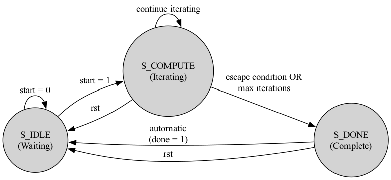

# Technical Implementation Details

This document provides a detailed technical breakdown of the core hardware components of the Mandelbrot Set Accelerator. It is intended as a companion to the main `README.md` for those interested in the specific Verilog/SystemVerilog implementation.

## Core Component: The Mandelbrot Pixel Solver FSM

The heart of the entire accelerator is the `mandelbrot_pixel_solver` module. The control logic for this module is implemented as a simple, robust Finite State Machine (FSM). This FSM is responsible for managing the iterative calculation for a single pixel.



### State Breakdown

The FSM consists of three states:

*   **`S_IDLE` (Waiting):** This is the default state. The machine waits here until the `start` signal is asserted by the parent module (`pixel_generator`). While `start` is low, it remains in this state. Upon receiving a `start` signal, it transitions to `S_COMPUTE` and initializes the iteration registers (`z_real`, `z_imag`, `current_iter`) to zero.

*   **`S_COMPUTE` (Iterating):** This is the primary work state. In every clock cycle spent in this state, the core calculation `z_next = z^2 + c` is performed. The FSM checks two conditions on every cycle:
    1.  **Escape Condition:** Has the magnitude of `z` exceeded the escape radius (i.e., `|z|^2 >= 4`)?
    2.  **Max Iterations:** Has the `current_iter` count reached the `max_iterations` limit provided by the CPU?
    
    If neither condition is met, the FSM remains in `S_COMPUTE`, incrementing the iteration counter. If either condition is met, the calculation is finished, and the FSM transitions to `S_DONE`.

*   **`S_DONE` (Complete):** This is a single-cycle state used to signal completion. It asserts the `done` output signal for one clock cycle. This `done` signal is critical for the handshaking logic in the parent module. The FSM automatically and unconditionally transitions from `S_DONE` back to `S_IDLE` on the next clock cycle, ready to process a new pixel.

*   **Reset (`rst`):** A global `rst` signal can force the FSM back to `S_IDLE` from any state, ensuring the system can be returned to a known-good configuration at any time.

### Verilog Implementation of the FSM

The FSM is implemented in `mandelbrot_pixel_solver.v` using standard FSM coding practices with three `always` blocks: one for state transitions, one for register updates, and one for output logic.

**1. State Definition:**
```systemverilog
// State machine definition
typedef enum logic [1:0] { S_IDLE, S_COMPUTE, S_DONE } state_t;
state_t state, next_state;
```

**2. State Transition Logic (`always_comb`):** This block implements the "arrows" of the state diagram.
```systemverilog
// Combinational logic for state transitions
always_comb begin
    next_state = state; // Default to stay in the same state
    done = 1'b0;

    case(state)
        S_IDLE: begin
            if (start) begin
                // Corresponds to "start = 1" transition
                next_state = S_COMPUTE;
            end
        end
        
        S_COMPUTE: begin
            // Corresponds to "escape condition OR max iterations" transition
            if ((zr_sq + zi_sq) >= ESCAPE_RADIUS_SQ) begin
                next_state = S_DONE;
            end else if (current_iter >= max_iterations_in) begin
                next_state = S_DONE;
            end else begin
                // Corresponds to "continue iterating" self-loop
                next_state = S_COMPUTE;
            end
        end

        S_DONE: begin
            done = 1'b1;
            // Corresponds to "automatic (done = 1)" transition
            next_state = S_IDLE;
        end
    endcase
end
```

**3. State Register Update (`always_ff`):** This block contains the memory element (flip-flops) for the FSM.
```systemverilog
// Sequential logic for updating the state register
always_ff @(posedge clk) begin
    if (rst) begin
        state <= S_IDLE;
    end else begin
        state <= next_state;
    end
end
```

## System-Level Integration: The `pixel_generator`

The `mandelbrot_pixel_solver` module is instantiated within the higher-level `pixel_generator.sv` wrapper. This wrapper is responsible for interfacing with the AXI buses and managing the flow of pixels for the entire screen.

The `start` and `done` signals of the FSM are crucial for the AXI4-Stream handshaking:

*   **Controlling the Solver:** The `pixel_generator` starts a new calculation by asserting the `start` signal. This is only done when the downstream VDMA is ready for a new pixel (`ready` is high) and the solver is not already busy (`!solver_done`).
    ```systemverilog
    // This logic connects the AXI stream status to the FSM's input
    assign solver_start = ready && !solver_done;
    ```

*   **Controlling the AXI Stream:** The `done` signal from the FSM becomes the `valid` signal for the AXI stream. This tells the VDMA that a new, valid pixel is available for transfer.
    ```systemverilog
    // The FSM's output controls the AXI stream
    wire valid_int = solver_done;
    ```
This handshaking mechanism ensures that the system correctly handles the variable time it takes to compute each pixel, preventing data loss or corruption and allowing the system to operate at maximum possible throughput.